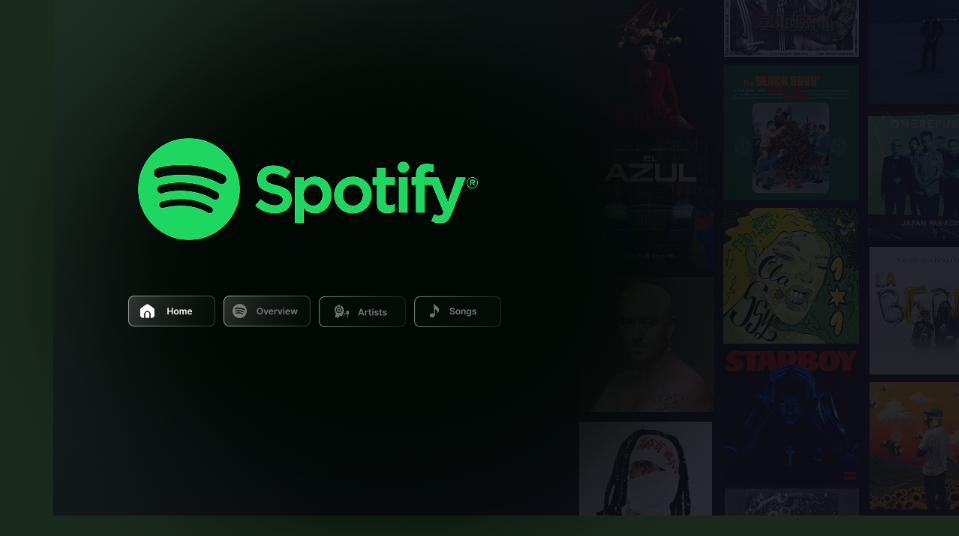
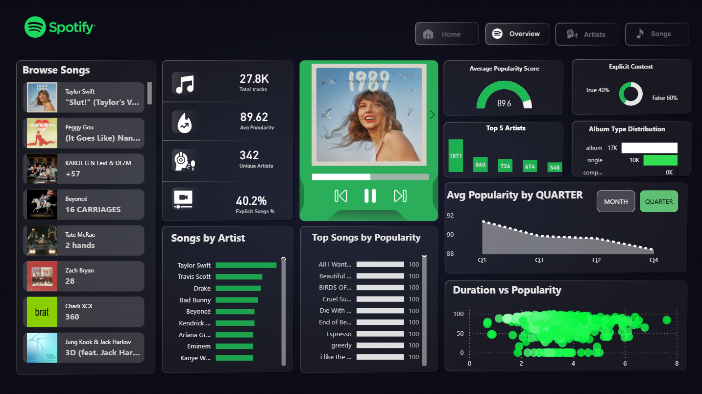
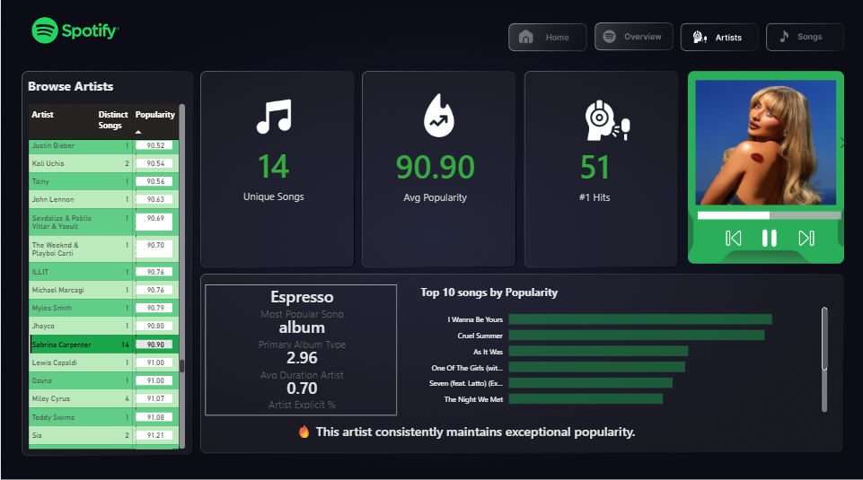
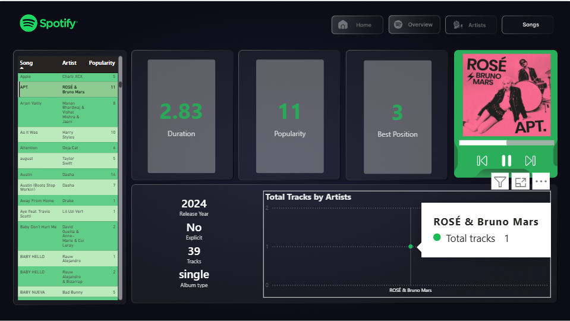

<div align="center">

# 🎵 Spotify Music Analytics Dashboard

### Interactive Power BI dashboard for exploring Spotify music trends, artist performance, and song insights.

<p>
  
  
  
  
</p>

</div>

---

# 📌 Project Overview

The **Spotify Music Analytics Dashboard** is an interactive Business Intelligence project built in **Microsoft Power BI** to transform raw Spotify streaming data into meaningful insights.

The dashboard enables users to analyze music trends through interactive visualizations, KPIs, slicers, and drill-down reports. It provides valuable insights into artist performance, song popularity, album distribution, release trends, and listening patterns while demonstrating an end-to-end BI workflow using **Power Query** and **DAX**.

---

# 🎯 Objectives

- Build an interactive music analytics dashboard
- Analyze artist and song performance
- Visualize popularity and release trends
- Create meaningful KPIs using DAX
- Demonstrate data cleaning and transformation using Power Query
- Deliver an intuitive and modern dashboard experience

---

# ✨ Dashboard Features

- Interactive Navigation
- Dynamic KPI Cards
- Artist Performance Analysis
- Song-Level Insights
- Popularity Analysis
- Release Trend Analysis
- Album Type Distribution
- Interactive Filters & Slicers
- Responsive Dashboard Layout
- Spotify-inspired UI Design

---

# 🖥 Dashboard Preview

## 🏠 Home

The landing page provides a clean interface for navigating across all dashboard pages.

<p align="center">

</p>

---

## 📊 Overview

The Overview page presents a high-level summary of the Spotify dataset using KPIs and interactive visualizations.

### Highlights

- Total Tracks
- Average Popularity
- Unique Artists
- Explicit Song Percentage
- Album Type Distribution
- Quarterly Popularity Trend
- Duration vs Popularity Analysis
- Top Artists
- Top Songs

<p align="center">

</p>

---

## 🎤 Artist Analysis

Explore artist performance through popularity metrics and detailed comparisons.

### Highlights

- Artist Popularity
- Number of Unique Songs
- Artist Rankings
- Top Songs by Popularity
- Artist Summary Statistics
- Interactive Artist Browser

<p align="center">

</p>

---

## 🎵 Song Analysis

Analyze individual tracks through song-level metrics and album information.

### Highlights

- Song Popularity
- Song Duration
- Best Chart Position
- Release Year
- Album Type
- Explicit Content
- Total Tracks per Artist

<p align="center">

</p>

---

# 💼 Business Questions Answered

This dashboard helps answer questions such as:

- Which artists consistently achieve the highest popularity?
- Which songs perform best on Spotify?
- How does popularity vary across different quarters?
- Which album types dominate the dataset?
- What percentage of songs contain explicit content?
- Which artists contribute the highest number of tracks?
- How are song duration and popularity related?
- How have music releases changed over time?

---

# ⚙ Data Preparation

The dataset was transformed using **Power Query** before visualization.

Data preparation included:

- Cleaning raw records
- Correcting data types
- Handling missing values
- Formatting date fields
- Creating calculated columns
- Optimizing data for reporting

---

# 📐 DAX Measures

The dashboard uses DAX to create dynamic KPIs and analytical measures, including:

- Total Tracks
- Average Popularity
- Unique Artists
- Explicit Song Percentage
- Maximum & Minimum Popularity
- Average Duration
- Custom KPI Measures

---

# 🛠 Tools & Technologies

| Technology | Purpose |
|------------|---------|
| Microsoft Power BI | Dashboard Development |
| Power Query | Data Cleaning & Transformation |
| DAX | Data Modeling & KPIs |
| CSV | Data Source |

---

# 📂 Repository Structure

```text
spotify-powerbi-dashboard/
│
├── dashboard/
│   └── spotify_dashboard.pbix
│
├── dataset/
│   └── spotify-top-50-world.csv
│
├── screenshots/
│   ├── home.png
│   ├── overview.png
│   ├── artist.png
│   └── songs.png
│
├── LICENSE
└── README.md
```

---

# 🚀 Getting Started

### Clone the repository

```bash
git clone https://github.com/n3h4a/spotify-powerbi-dashboard.git
```

### Open the dashboard

1. Install **Microsoft Power BI Desktop**
2. Open `spotify_dashboard.pbix`
3. Refresh the dataset if required
4. Explore the dashboard using filters, slicers, and interactive visuals

---

# 📈 Key Skills Demonstrated

- Business Intelligence
- Data Visualization
- Dashboard Design
- Data Cleaning
- ETL using Power Query
- DAX Calculations
- KPI Development
- Interactive Reporting

---

# 🔮 Future Enhancements

- Spotify Web API integration
- Real-time dashboard updates
- Genre-wise analytics
- Playlist analytics
- Listening behavior analysis
- Predictive trend forecasting

---

# 👩‍💻 Author

**Neha Karamchandani**

B.Tech – Information Technology

Passionate about **Data Analytics**, **Business Intelligence**, **Power BI**, **SQL**, and **Data Visualization**.

---

<div align="center">

### ⭐ If you found this project interesting, consider giving it a star!

</div>
